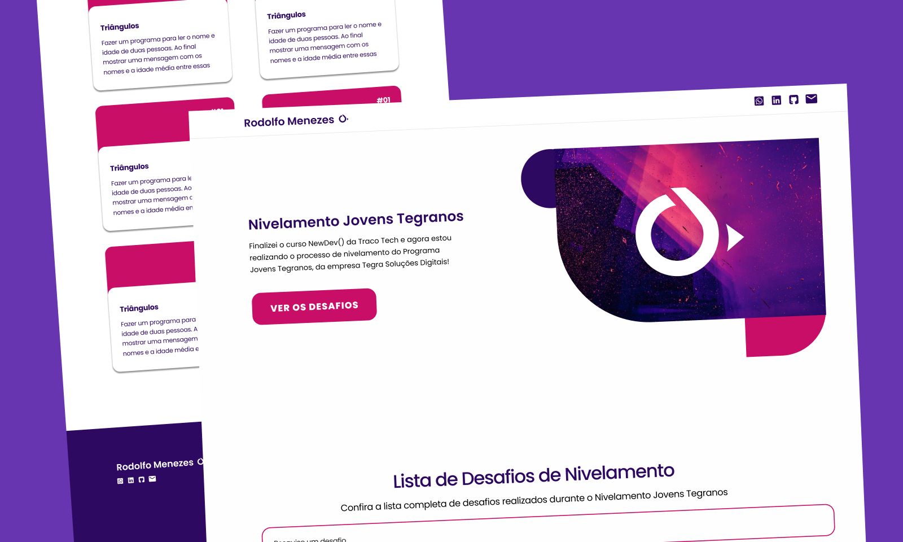

# Traco Tech - Projeto de Nivelamento

Este é meu o Projeto de Nivelamento do Programa Jovens Tegranos, uma iniciativa da empresa [Tegra](https://tegra.com.br) que tem como objetivo formar e capacitar jovens talentos na área de tecnologia. Através de uma lista de desafios, o projeto busca avaliar as habilidades dos candidatos que concluíram o curso [New Dev()](https://tracotech.com.br/new-dev/), no qual são ensinados conceitos de Soft Skills, Lógica de Programação, JavaScript, HTML e CSS.

__Diferenciais do meu Projeto__

- Listagem dos desafios (com simulação de busca de API)

- Sistema de pesquisa de desafos

- Responsividade

- [Design no Figma - clique para vizualizar o design](https://www.figma.com/file/RMEsw80UE9n6K8KhROVKeR/Jovens-Tegranos?node-id=945%3A233&t=Yk9j1mXkdDYjFLR6-1)

- [Deploy - clique para vizualizar o projeto](https://jovens-tegranos-nivelamento.vercel.app) 
